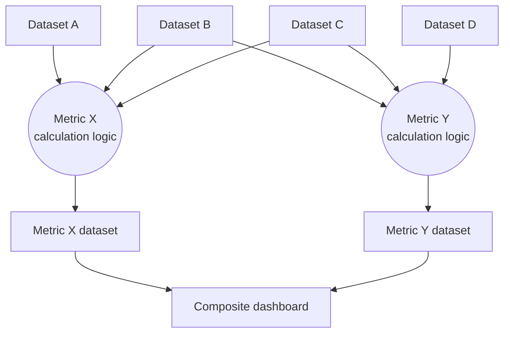

# Business Observability Platform

## Rationale

**Metrics description and architecture**(https://maersk-tools.atlassian.net/wiki/x/fYCYEys)

Business  Observability Platform provides end-to-end traceability on digitised and standardised Service Delivery Ocean processes, while creating clear connections between business outcomes and operational tasks through Maersk aligned metric structure. The visibility and traceability that business observability provides will unlock The Maersk Way Problem Solving & Operational Excellence, allowing operators to create a path for green business outcomes by viewing the operational work created through INDEX tasks.

## Definitions and desired metric structure

The following table states the different metric types in scope and the intended metric structure.

| Metric type | Description | Example |
|---|---|---|
| **Outcome** | Measures end-state results, such as cost reduction, efficiency gained, risk lowered, etc. that the wide organisation state as objectives. It answers the question: _which is our goal as a business?_ | Bunker cost reduction |
| **Performance / Leading** | Measures the current trajectory, for instance, throughput, cycle time, SLA compliance… before the outcome is fully realised. A leading signal that lets teams act before results are locked in. It answers the question: _how close are we to reach our goal?_ | Bunker waste reduction |
| **Process** | Measures step-level health — adherence, bottlenecks, accuracy... The diagnostic layer that explains why a leading metric is degrading. It answers the question: _where in the process is performance breaking down?_ | Estimated Time of Arrival (ETA) accuracy |
| **Adoption** | Measures coverage and engagement, for instance percentage of eligible cases on-platform, active users, workaround rate… it checks the validity of the approach, low adoption means the other metrics only describe a fraction of reality. It answers the question: _how much of the process is actually running through the platform?_ | Percentage of ETA sent to vessel |

The order of these metrics mirrors the way an individual looks at the process: start with outcomes, such as "is the business goal being met"? If not, move to performance metrics to see whether it's a trend or a one-off case. If performance is degrading, process metrics pinpoint which step or task is the troublemaker. Adoption sits last because it reframes everything above it: a 90% SLA compliance rate looks healthy until adoption reveals only 40% of cases are running through the platform.

Ordered this way, each layer answers the natural next question raised by the one before it.

## Collaboration framework

### Introduction

Once business needs are established and clear, several things will need to happen before a dashboard with relevant information is available to support colleagues from operations. Things like identifying the right data source, getting access to datasets or building new integrations, developing one (or many) data-transformation pipeline(s), deploying jobs and data quality checks, defining the dashboard user interface…

All these steps will require different teams with diverse knowledge and expertise to work together and collaborate. This section defines a common framework to allow these teams to use the same definitions, processes and mental models in order to successfully complete what is needed.

### Scope and responsibility

**Business Observability team**
- Capture and refine business requirements from the product organization
- Maintain and govern the shared metric store structure
- Implement metric calculation pipelines and define metric datasets
- Build and manage dashboards
- Run onboarding and/or coordination sessions
- Monitor metric-level dataset data quality

**Domain-specific team**
- Implement and maintain domain dataset ingestion pipelines, including new cross-domain integrations (Kafka topics or APIs)
- Own domain dataset data quality
- Manage and respond to alerts for domain-level datasets
- Notify the platform of upstream data schema changes

### Pre-requisites

#### Requirements refinement

The BOP team will capture and refine the business requirements for a particular dashboard using a set of different metrics. Each metric must be mapped to an outcome goal (cost reduction, efficiency, risk, CX, etc.). No metric should enter the platform without a declared goal alignment — this forces the team to answer "why does this metric matter" before writing a single line of implementation.

> **Expected output:** A collection of Jira work items that are refined, with clear acceptance criteria.

#### Data sources

The first step when developing a new metric is to identify data dependencies for the required metrics, as the teams managing source-of-truth applications may need to develop new interfaces for data sourcing into the data ingestion layer.

For instance, if there is a requirement to build a dashboard showing capacity utilisation percentage, then datasets from CAPI (current/forecasted container utilisation), COMET (container load/discharge events and vessel release) and Captura (vessel capacity or intake) will likely be required. Are all these datasets in Pipedream already? If not, can the data be sourced into Pipedream from an existing Retina topic or API? If that is not the case, a new requirement needs to be raised towards the team managing the source-of-truth application, and coordination and prioritisation must happen.

Missing data sources must be identified quickly, as engineering teams are usually busy with business deliveries or other priorities.

> **Expected output:** A specific and detailed list of identified domain-level datasets readily available for use to calculate required metrics. Additionally, if no already existing datasets are identified, a collection of refined Jira work items with clear acceptance criteria in the backlog of the team managing the source-of-truth application. Ideally these work items will have a clear delivery timeline.

#### Access

Once the source and potential datasets are identified, if access is not already in place, an access request needs to be raised. Depending on the solution hosting the data:

- **Pipedream:** [Access Control](https://maersk-digital.atlassian.net/wiki/spaces/PIPEDREAM/pages/access-control)
- **Maestro:** [Databook](https://databook.maersk.com)
- **SafeAccess (SSAS Cubes):** [https://safeaccess.azurewebsites.net/home](https://safeaccess.azurewebsites.net/home)

> **Expected output:** BOP engineers can access and read the identified datasets, and there is an understanding of the schema and information included there.

### Development standards

#### Job and dataset granularity

Ideally each job must only generate a single dataset with one metric granularity. For instance, if there is a need to present long-term ETA accuracy, the job should only calculate that — nothing more — and then store the result in a single Pipedream dataset or table. This promotes dataset reusability and flexibility, avoiding having multiple jobs calculating the same metrics.

#### Naming conventions

- **Pipedream tenant for metric calculation and storage:** [`tenants/indexsymphony/observability-platform`](https://github.com/Maersk-Global/pipedream/tree/main/tenants/indexsymphony/observability-platform)
- **Pipedream tenant for domain-level datasets:** domain application dependent
- **Pipedream job/dataset name:** `observability_[metric_name]_[metric_type]`
  - Example: `observability_longtermETA_accuracy`

#### Datasets, processing jobs and dashboard hierarchy

The diagram below illustrates the layered data flow from domain datasets through metric calculation jobs into the composite dashboard.

Domain datasets (rectangles at the bottom of the flow) are owned by domain-specific teams. Shared datasets — those feeding more than one metric — highlight cross-domain dependencies that must be coordinated early. Metric calculation logic (ellipses) is owned by the BOP team and produces isolated metric datasets, each consumed by one or more dashboards.

